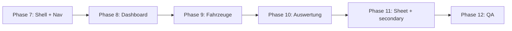

# Tankly – Mobile UI Design Alignment Plan

Implementation guide to align the **authenticated mobile experience** (`< lg`) with the Tankly mobile design reference (ChatGPT mockup, July 2026).

**Status:**
- **Baseline (Phases 0–6):** ✅ Complete — scroll fixes, responsive lists, tables, settings, marketing polish
- **Design alignment (Phases 7–12):** 📋 Planned — match reference mockup screen-by-screen

**Prerequisites:** Phases 0–23 app features complete. Baseline mobile optimization merged.

**Related docs:** [DEVELOPMENT_PLAN.md](./DEVELOPMENT_PLAN.md) · [TECHNICAL_DOCUMENTATION.md](./TECHNICAL_DOCUMENTATION.md) · `.github/copilot-instructions.md`

**Design reference:** Mobile mockup showing Dashboard, Fahrzeuge, Auswertung, and Add bottom sheet. Reference images live in [`.docs/assets/`](./assets/) (e.g. `mobile-mockup.png`, `mobile-mockup-chatgpt-2026-07-09.png`). Logo draft assets: `logo-head.png`, `logo-head-tmp.png`.

---

## Table of contents

1. [Design target summary](#1-design-target-summary)
2. [Baseline already shipped](#2-baseline-already-shipped)
3. [Gap analysis: mockup vs app today](#3-gap-analysis-mockup-vs-app-today)
4. [Mobile design system](#4-mobile-design-system)
5. [Architecture approach](#5-architecture-approach)
6. [Implementation phases (7–12)](#6-implementation-phases-712)
7. [Phase 7 – Shell & navigation](#7-phase-7--shell--navigation)
8. [Phase 8 – Dashboard mobile layout](#8-phase-8--dashboard-mobile-layout)
9. [Phase 9 – Fahrzeuge mobile cards](#9-phase-9--fahrzeuge-mobile-cards)
10. [Phase 10 – Auswertung mobile experience](#10-phase-10--auswertung-mobile-experience)
11. [Phase 11 – Add bottom sheet & secondary screens](#11-phase-11--add-bottom-sheet--secondary-screens)
12. [Phase 12 – Polish, QA & rollout](#12-phase-12--polish-qa--rollout)
13. [Scope boundaries & DECISION_LOG items](#13-scope-boundaries--decision_log-items)
14. [Testing strategy](#14-testing-strategy)
15. [Manual QA checklist (design)](#15-manual-qa-checklist-design)
16. [Effort estimates](#16-effort-estimates)
17. [File map](#17-file-map)

---

## 1. Design target summary

The reference mockup defines a **native-app-style mobile shell** for farm operators:

| Principle | Mockup behavior |
|-----------|-----------------|
| **Primary navigation** | 5-tab bottom bar: Dashboard · Fahrzeuge · **+** · Auswertung · Profil |
| **Header** | Logo + “Tankly” left; contextual actions right (bell on dashboard, back/+ on sub-pages) |
| **Content** | Single-column, card-based, generous whitespace; no desktop-style multi-column grids |
| **Primary CTA** | Full-width green “+ Tankvorgang” on dashboard (mobile) |
| **KPIs** | 2×2 “Überblick” grid — compact tiles, not large desktop KPI cards |
| **Lists** | Icon + title + metadata rows; section headers with “Alle anzeigen →” |
| **Add flow** | Center FAB opens **bottom sheet** with titled list rows + Abbrechen |
| **Auswertung** | Segmented tabs (Verbrauch / Kosten / Tankungen) + hero stat + chart + per-vehicle breakdown |

Desktop (`lg+`) keeps the existing sidebar layout and dashboard grid unchanged.

---

## 2. Baseline already shipped

Phases 0–6 addressed **technical mobile fitness** (no new visual design):

| Phase | Done | Key changes |
|-------|------|-------------|
| 0–1 | ✅ | `overflow-x: clip`, `min-w-0` shrink chain, CSS `?v=7` |
| 2 | ✅ | Stacked bottom-nav labels, responsive headings, header truncation |
| 3 | ✅ | Stacked list rows, hidden desktop quick-actions on mobile, responsive KPI type |
| 4 | ✅ | Contained table scroll (`table_scroll_panel`), compact table cells |
| 5 | ✅ | Stacked group-settings forms, invite-code scaling, `group_card` stack |
| 6 | ✅ | Landing pricing single-column on smallest screens |

Tests: `tests/test_mobile_layout.py` (20 tests).

**What baseline did *not* do:** Restructure navigation, redesign cards, add bottom sheet, or match mockup typography/spacing.

---

## 3. Gap analysis: mockup vs app today

### 3.1 Global shell (`base.html`)

| Element | Mockup | Current app (`< lg`) | Gap |
|---------|--------|----------------------|-----|
| Bottom tabs | Dashboard · Fahrzeuge · + · Auswertung · Profil | Start · Tanken · + · Fuhrpark · Mehr | Wrong tabs, order, labels; “Mehr” is a catch-all |
| Tab icons | Line-style icons, active = green | Emoji icons | Different visual language |
| Center FAB | Elevated circle, primary green | Square `rounded-[10px]` button | Shape/size mismatch |
| Add menu | Full bottom sheet overlay | Small 3-button card above nav | Not a sheet; no title, no Abbrechen |
| Mobile header | Logo + Tankly; bell on dashboard | Logo + user name + Betrieb wechseln | Wrong right-side actions |
| Profile access | Dedicated tab | Buried in “Mehr” / header link | Extra taps |
| Fuel / Maintenance | Not in bottom nav | “Tanken” tab + Mehr menu | Mockup uses dashboard lists + FAB only |

### 3.2 Dashboard (`dashboard.html`)

| Element | Mockup | Current | Gap |
|---------|--------|---------|-----|
| Greeting | In content, large | In content ✅ | Close; bell should be in header not hidden until `sm` |
| Today card | Icon + “Noch keine Tankungen heute” | Same content ✅ | Layout OK |
| Primary CTA | **Full-width** “+ Tankvorgang” below today card | Hidden on mobile (`hidden sm:flex`) | **Missing** on mobile — mockup shows it prominently |
| KPI section | “Überblick” label + **2×2 compact tiles** | 1-col → 2-col large `kpi_card` | Tiles too tall; no section title; 4th label differs (“In 30 Tagen” vs “In den nächsten 30 Tagen”) |
| Charts | **Not shown** on mobile dashboard | Verbrauch + Kosten charts always visible | Hide charts on `< lg` or collapse below fold |
| Recent fuel | Section + “Alle anzeigen →” | List + full-width button at bottom | Link style differs |
| Maintenance | Compact list with countdown | Amber cards, max 2 items | Close; tune copy (“in 12 Tagen”) |
| Vehicles preview | Not on mobile dashboard | Shown in 3rd column | Remove/hide on mobile per mockup |

### 3.3 Fahrzeuge (`vehicles.html` + `vehicle_card`)

| Element | Mockup | Current | Gap |
|---------|--------|---------|-----|
| Header | Back + “Fahrzeuge” + `+` | `page_header` with subtitle + CSV button | Wrong mobile header pattern |
| Card layout | Large **photo**, model, **license plate**, Aktiv badge | Gradient thumb, name, type chips | No photos; **no license plate field in DB** |
| Stats row | Ø Verbrauch · Wartung in X Tagen | Quick actions (Tanken/Wartung) | Different data emphasis |
| Add prompt | Dashed card “Fahrzeug hinzufügen” + FAB | `empty_state` or header button | Missing dashed CTA card |
| Grid | Single column full-width cards | `sm:grid-cols-2` | OK to keep 1 col on mobile |

### 3.4 Auswertung (`analytics.html`)

| Element | Mockup | Current | Gap |
|---------|--------|---------|-----|
| Title | “Auswertung” | “📊 Einblicke” + long subtitle | Simpler title on mobile |
| Navigation | **Pill tabs:** Verbrauch · Kosten · Tankungen | All charts on one scroll page | No segmented control |
| Hero stat | “5,8 L/100 km” + trend badge “-0,4 L vs. vorherige 30 Tage” | 4 KPI cards + multiple charts | Need computed trend (may need backend) |
| Chart | Single line chart for active tab | 3–4 separate chart panels | Consolidate per tab |
| Breakdown | “Verbrauch nach Fahrzeug” list with trend chips | Bar chart only | Add list view with per-vehicle trend |

### 3.5 Add bottom sheet (modal)

| Row | Mockup | Current | Gap |
|-----|--------|---------|-----|
| Tankvorgang | Icon + title + subtitle | Button in grid | Sheet row pattern |
| Wartung | Icon + title + subtitle | Button in grid | Same |
| Ausgabe | Icon + “Sonstige Betriebsausgabe erfassen” | **Not in app** | See [§13 scope](#13-scope-boundaries--decision_log-items) |
| Abbrechen | Full-width text button | Toggle FAB again | Missing explicit cancel |

### 3.6 Screens not in mockup (keep accessible, lower priority)

| Screen | Mobile access today | Proposed |
|--------|---------------------|----------|
| Tankvorgänge (`/fuel`) | Bottom “Tanken” tab | Profile/settings overflow or dashboard “Alle anzeigen”; **remove from bottom nav** |
| Wartungen (`/maintenance`) | Mehr menu | Dashboard section + FAB; optional link in Profil |
| Zusammenfassung (`/summary`) | Mehr menu | Link from Auswertung or Profil |
| Einstellungen | Mehr menu | Profil screen |
| Betrieb wechseln | Header + Mehr | Profil screen |

---

## 4. Mobile design system

New CSS classes in `app.css` (mobile-only or shared):

```css
/* Bottom sheet */
.t-bottom-sheet-backdrop { ... }
.t-bottom-sheet { border-radius: 20px 20px 0 0; ... }

/* Compact KPI tile (2×2 grid) */
.t-kpi-tile { padding: 0.875rem; border-radius: 14px; ... }
.t-kpi-tile__value { font-size: 1.375rem; font-weight: 700; }
.t-kpi-tile__label { font-size: 0.75rem; color: var(--tankly-muted); }

/* Segmented control */
.t-segmented { display: flex; background: #f1f5f9; border-radius: 12px; padding: 4px; }
.t-segmented__btn--active { background: white; box-shadow: ... }

/* Mobile page header */
.t-mobile-header { min-height: 3.5rem; ... }

/* Vehicle hero card */
.t-vehicle-hero-card { ... }
.t-vehicle-hero-card__image { aspect-ratio: 16/9; ... }

/* Dashed add card */
.t-add-card-dashed { border: 2px dashed ...; }
```

### Spacing & typography (`< lg` only)

| Token | Value | Usage |
|-------|-------|-------|
| Page padding | `px-4` (16px) | Already used |
| Section gap | `space-y-4` (16px) | Tighter than desktop `space-y-5` |
| Card radius | `16px` (`rounded-[16px]`) | Match mockup |
| Primary button height | `48px` (`min-h-[48px]`) | Full-width CTAs |
| Section title | `text-sm font-semibold text-slate-900` | “Überblick”, “Letzte Tankvorgänge” |
| Greeting | `text-xl font-bold` | Slightly smaller than desktop 28px |

### Icons

Mockup uses **line icons**, not emoji. Options:

| Option | Pros | Cons |
|--------|------|------|
| **A (recommended)** | Reuse existing SVG macros in `_macros.html` (`icon_home`, `icon_vehicle`, etc.) for nav + sheet | Some icons may need new variants |
| B | Heroicons via inline SVG | More markup |
| C | Keep emoji for v1 | Visual mismatch with mockup |

---

## 5. Architecture approach

### 5.1 One shell, two layouts

```
base.html
├── lg:hidden  → mobile_shell (new partials)
│   ├── mobile_header.html (context-aware)
│   ├── mobile_bottom_nav.html
│   └── mobile_add_sheet.html (Alpine)
└── lg:flex    → existing sidebar (unchanged)
```

Use `` or macros — **not** a second template base, to avoid duplicating auth/flash/CSRF logic.

### 5.2 Responsive blocks, not duplicate pages

Prefer `max-lg:` / `lg:hidden` / `hidden lg:block` in existing templates over separate mobile templates.

Example — dashboard:

```html
<!-- Mobile-only -->
<div class="space-y-4 lg:hidden">...</div>
<!-- Desktop-only -->
<div class="hidden lg:block dashboard-grid">...</div>
```

### 5.3 New macros (`_macros.html`)

| Macro | Purpose |
|-------|---------|
| `mobile_header(title, back_href, action_href)` | Back + title + optional `+` |
| `kpi_tile(emoji, value, label, helper)` | 2×2 compact tile |
| `section_link_header(title, href, link_label)` | Title + “Alle anzeigen →” |
| `bottom_sheet_row(icon, title, subtitle, href)` | Add sheet row |
| `segmented_control(tabs, active)` | Auswertung tabs |
| `vehicle_hero_card(vehicle, stats)` | Mockup-style vehicle card |
| `trend_chip(delta, unit)` | Green/red trend badge |

### 5.4 Backend data gaps

Some mockup data needs new queries (no schema change required for most):

| Data | Source today | Work needed |
|------|--------------|-------------|
| Ø Verbrauch per vehicle | `average_consumption_for_vehicle()` | Expose in vehicles list context |
| Wartung in X Tagen | `list_group_reminders()` | Per-vehicle next reminder in vehicle card |
| Trend vs previous 30 days | Not computed | New helper in `app/services/analytics.py` or extend dashboard service |
| Per-vehicle consumption trend | Not computed | Compare 30d windows per vehicle |
| License plate | **No DB field** | Skip or use vehicle name only (see D-M10) |
| Vehicle photo | Gradient thumb only | Keep thumb; optional static placeholders by `vtype` |

---

## 6. Implementation phases (7–12)



| Phase | Focus | Est. |
|-------|-------|------|
| 7 | Bottom nav, header, bottom sheet shell | 1–1.5 d |
| 8 | Dashboard mobile layout | 1–1.5 d |
| 9 | Vehicle hero cards | 1 d |
| 10 | Auswertung tabs + trends | 1.5–2 d |
| 11 | Profil tab, secondary routes, fuel/maintenance mobile headers | 1 d |
| 12 | Polish, tests, QA | 0.5–1 d |

**Total:** ~6–8 days for full mockup alignment.

---

## 7. Phase 7 – Shell & navigation

### 7.1 Bottom navigation (match mockup)

**Target tabs (left → right):**

1. **Dashboard** → `/dashboard` (icon: home)
2. **Fahrzeuge** → `/vehicles` (icon: car)
3. **+** → opens add sheet (not a route)
4. **Auswertung** → `/analytics` (icon: chart) — gate on entitlement
5. **Profil** → `/profile` (icon: user)

**Remove from bottom nav:** Tanken, Fuhrpark, Mehr.

**Move to Profil screen:** Betrieb wechseln, Einstellungen, Zusammenfassung, Abmelden, Wartungen link, Tankvorgänge link (or keep fuel accessible via dashboard).

### 7.2 Center FAB

```html
<button class="t-fab -mt-5 h-14 w-14 rounded-full t-btn-primary shadow-lg ...">
```

Elevated above nav bar (negative margin), circular, white `+`.

### 7.3 Add bottom sheet

Alpine state in `base.html` (or partial):

```html
<div x-show="addSheetOpen" class="t-bottom-sheet-backdrop fixed inset-0 z-50 lg:hidden" @click="addSheetOpen = false">
  <div class="t-bottom-sheet" @click.stop>
    <h2>Was möchtest du hinzufügen?</h2>
    <!-- rows -->
    <button @click="addSheetOpen = false">Abbrechen</button>
  </div>
</div>
```

Rows (if `user_can_edit`):

| Row | href | Notes |
|-----|------|-------|
| Tankvorgang | `/fuel/new` | Always |
| Wartung | `/maintenance/new` | If maintenance entitlement |
| Fahrzeug | `/vehicles/new` | **Add** — mockup shows Ausgabe instead; we use Fahrzeug unless D-M09 chooses Ausgabe stub |

**Ausgabe row:** Defer unless expense feature approved (§13).

### 7.4 Mobile header variants

| Page type | Left | Center | Right |
|-----------|------|--------|-------|
| Dashboard | `brand_lockup` | — | Bell → `/maintenance` if reminders |
| Tab roots (Fahrzeuge, Auswertung, Profil) | — | Page title | Context action |
| Fahrzeuge | — | “Fahrzeuge” | `+` → `/vehicles/new` |
| Sub-pages (forms, detail) | Back arrow | Title | Save/action |

Replace current generic header (user name + Betrieb wechseln) on primary tab routes.

### Tasks

- [ ] Create `mobile_bottom_nav.html` partial
- [ ] Create `mobile_add_sheet.html` partial
- [ ] Create `mobile_header.html` with `header_variant` block or macro
- [ ] Wire active tab state from `request.url.path`
- [ ] Remove `moreOpen` grid menu
- [ ] Update `pb-[calc(...)]` for taller FAB if needed

### Tests

```
test_mobile_bottom_nav_has_five_mockup_tabs
test_mobile_bottom_nav_links_profile_and_analytics
test_add_sheet_has_title_and_abbrechen
test_add_sheet_lists_fuel_and_maintenance_rows
test_dashboard_mobile_header_has_notification_link
```

### Acceptance

- [ ] Bottom nav matches mockup labels and order at 375px
- [ ] FAB opens sheet; Abbrechen closes; backdrop tap closes
- [ ] Desktop sidebar unchanged

---

## 8. Phase 8 – Dashboard mobile layout

### 8.1 Mobile-only content block (`lg:hidden`)

Vertical order:

1. Greeting + subtitle (existing copy)
2. Today fuel card (existing `glass_panel`)
3. **Full-width** `+ Tankvorgang` button (`min-h-[48px]`, only if `can_edit`)
4. Section **“Überblick”** + 2×2 `kpi_tile` grid
5. **“Letzte Tankvorgänge”** + `section_link_header` → `/fuel`
6. `fuel_entry_row` list (max 5)
7. **“Wartungen”** + link → `/maintenance`
8. Maintenance reminder rows (compact)

### 8.2 Hide on mobile

- `dashboard-grid` (charts, vehicles preview, 3-column layout)
- Desktop quick-action row (already hidden)
- KPI `kpi_card` large cards → use `kpi_tile` instead on mobile

### 8.3 Desktop (`hidden lg:block`)

Keep existing dashboard unchanged.

### Tasks

- [ ] Add `kpi_tile` macro
- [ ] Add `section_link_header` macro
- [ ] Split `dashboard.html` into mobile/desktop blocks
- [ ] Show bell in mobile header when `service_reminders`
- [ ] Mobile primary CTA `+ Tankvorgang`

### Tests

```
test_dashboard_mobile_shows_full_width_tankvorgang_cta
test_dashboard_mobile_shows_ueberblick_section
test_dashboard_mobile_hides_chart_grid
test_dashboard_mobile_shows_alle_anzeigen_link_for_fuel
```

### Acceptance

- [ ] Mobile dashboard matches mockup structure (no charts, 2×2 KPIs, lists)
- [ ] Desktop dashboard still shows charts and 3-column grid

---

## 9. Phase 9 – Fahrzeuge mobile cards

### 9.1 Mobile header

Replace `page_header` on `< lg` with `mobile_header("Fahrzeuge", action="/vehicles/new")`.

### 9.2 `vehicle_hero_card` macro

```
┌─────────────────────────────┐
│  [vehicle image / thumb]    │
│  Audi A4                    │
│  S-AB 1234  (or skip)       │
│  [Aktiv]                    │
│  ⛽ 5,8 L/100km · 🔧 12 Tage│
└─────────────────────────────┘
```

**Image:** Use enlarged `vehicle_thumb` or type-specific placeholder illustrations (tractor, car, machine) — no user-upload photos in v1.

**License plate:** Omit until D-M10; show `vehicle_type_label` as secondary line instead.

### 9.3 Dashed add card

At list bottom (if `can_edit`):

```html
<a href="/vehicles/new" class="t-add-card-dashed t-card flex items-center justify-between p-4">
  <span>Fahrzeug hinzufügen</span>
  <span class="t-fab-sm">+</span>
</a>
```

### 9.4 Backend

Extend `vehicles` route context:

- `avg_consumption` per vehicle (nullable)
- `next_maintenance_days` per vehicle (nullable, from reminders service)

### Tasks

- [ ] `vehicle_hero_card` macro
- [ ] Service helper `vehicle_mobile_stats(group_id, vehicles)`
- [ ] `vehicles.html` mobile layout: single column + dashed add card
- [ ] Hide `page_header` subtitle/CSV on mobile (CSV → Profil or overflow menu)

### Tests

```
test_vehicles_mobile_uses_hero_card_layout
test_vehicles_mobile_shows_dashed_add_card
test_vehicles_mobile_header_has_plus_action
```

---

## 10. Phase 10 – Auswertung mobile experience

### 10.1 Segmented tabs (client-side)

Alpine `activeTab: 'verbrauch' | 'kosten' | 'tankungen'` — no new routes.

| Tab | Content |
|-----|---------|
| Verbrauch | Hero avg L/100km + trend chip + line chart (30d) + vehicle breakdown list |
| Kosten | Total € + trend + bar chart (6mo) |
| Tankungen | Count + chart or list by month |

### 10.2 Trend computation

New function in `app/services/analytics.py` (or extend existing):

```python
def consumption_trend_30d(db, group_id) -> dict:
    # current_30d_avg, previous_30d_avg, delta, label
```

Per-vehicle trends for breakdown list.

### 10.3 Mobile layout

- Hide 4-up `kpi_card` row on mobile
- Hide secondary charts not in active tab
- `segmented_control` at top below title “Auswertung”

### Tasks

- [ ] `segmented_control` macro
- [ ] `trend_chip` macro
- [ ] Trend helpers + tests in `tests/test_analytics.py`
- [ ] Refactor `analytics.html` with tab panels
- [ ] Vehicle breakdown list with trend chips

### Tests

```
test_analytics_mobile_has_segmented_control
test_analytics_mobile_shows_consumption_trend_badge
test_consumption_trend_30d_computes_delta
```

### Acceptance

- [ ] Auswertung on 375px matches mockup tab pattern
- [ ] Desktop analytics page still shows full dashboard-style charts

---

## 11. Phase 11 – Add bottom sheet & secondary screens

### 11.1 Profil tab screen

Ensure `/profile` works as mobile hub:

- User name + email
- Links: Betrieb wechseln, Einstellungen, Zusammenfassung, Tankvorgänge, Wartungen, Abmelden
- Card-based list rows (mockup Profil tab style)

### 11.2 Secondary pages mobile headers

| Page | Mobile header |
|------|---------------|
| `/fuel` | Back → Dashboard, “Tankvorgänge”, `+` if edit |
| `/fuel/new` | Back, “Tankvorgang”, — |
| `/maintenance` | Back, “Wartungen”, `+` |
| `/settings/group` | Back, “Einstellungen”, — |

Use `mobile_header` macro; hide `page_header` on `< lg`.

### 11.3 Fuel & maintenance lists

Already stacked from baseline — tune to match mockup row density (less padding, clearer right-aligned cost).

### Tasks

- [ ] Profil hub links section
- [ ] `mobile_header` on fuel, maintenance, settings
- [ ] Remove dependency on “Mehr” menu (deleted in Phase 7)

---

## 12. Phase 12 – Polish, QA & rollout

- [ ] Active tab highlight (green icon + label) matches mockup
- [ ] Safe-area insets on bottom sheet + nav (iPhone)
- [ ] Bump `app.css?v=` and `sw.js` cache
- [ ] Snapshot reference screenshots at 375px for regression
- [ ] Update `tests/test_mobile_layout.py` for design assertions
- [ ] Manual QA on real device

---

## 13. Scope boundaries & DECISION_LOG items

| ID | Decision | Mockup | Recommendation |
|----|----------|--------|----------------|
| D-M07 | Bottom nav items | 5 tabs as mockup | Adopt exactly; drop Tanken/Mehr |
| D-M08 | Ausgabe in add sheet | Third row | **Defer** — no expense model; use **Fahrzeug** as third row |
| D-M09 | Vehicle photos | Real car images | Type-based placeholders v1; no upload feature |
| D-M10 | License plate | Shown on card | **Omit** — no DB field; show fuel type or usage unit |
| D-M11 | Dashboard charts on mobile | Not shown | Hide `< lg`; keep on desktop |
| D-M12 | Icon set | Line icons | SVG macros (option A) |
| D-M13 | Analytics trends | Required for mockup | Add service helpers; no migration |
| D-M14 | Fuel tab removal | Not in mockup | Access via dashboard + Profil |

Record decisions in [DECISION_LOG.md](./DECISION_LOG.md) when implementing.

---

## 14. Testing strategy

Follow TDD per `.github/copilot-instructions.md`:

1. **Red** — Add tests to `tests/test_mobile_layout.py` and `tests/test_mobile_design.py` (new, optional split)
2. **Green** — Template/CSS changes only unless trend analytics needs service code
3. **Refactor** — Extract partials/macros

### Test types

| Type | Example |
|------|---------|
| HTML structure | `lg:hidden`, `t-bottom-sheet`, tab labels |
| Route wiring | Profile tab → `/profile` |
| Service | `consumption_trend_30d()` delta math |
| Regression | Desktop dashboard still contains `dashboard-grid` |

### Not in scope for automated tests

- Pixel-perfect Figma match
- Animation timing of bottom sheet

---

## 15. Manual QA checklist (design)

At **375px** and on one real iPhone/Android:

### Shell
- [ ] 5 tabs match mockup: Dashboard · Fahrzeuge · + · Auswertung · Profil
- [ ] FAB is circular and elevated
- [ ] Add sheet: title, 2–3 rows, Abbrechen, backdrop dismiss
- [ ] Active tab highlighted green

### Dashboard
- [ ] Logo + Tankly + bell in header
- [ ] Greeting with wave
- [ ] Today card + full-width green Tankvorgang button
- [ ] “Überblick” 2×2 tiles
- [ ] Letzte Tankvorgänge with arrow link
- [ ] Wartungen section
- [ ] No charts on mobile

### Fahrzeuge
- [ ] Title header with +
- [ ] Large vehicle cards, single column
- [ ] Dashed add card at bottom

### Auswertung
- [ ] Three pill tabs
- [ ] Hero stat + trend badge on Verbrauch
- [ ] Vehicle breakdown with trends

### Desktop regression (`1024px+`)
- [ ] Sidebar unchanged
- [ ] Dashboard 3-column grid + charts
- [ ] No bottom nav visible

---

## 16. Effort estimates

| Phase | Hours |
|-------|-------|
| 7 – Shell & nav | 8–12 |
| 8 – Dashboard | 8–12 |
| 9 – Fahrzeuge | 6–8 |
| 10 – Auswertung | 12–16 |
| 11 – Secondary | 6–8 |
| 12 – QA | 4–6 |
| **Total** | **44–62 h (~6–8 days)** |

**Suggested PRs:**

1. PR-A: Phase 7 (shell) — highest visible impact
2. PR-B: Phases 8 + 9 (dashboard + vehicles)
3. PR-C: Phases 10 + 11 (analytics + profil)
4. PR-D: Phase 12 polish

---

## 17. File map

| File | Phases |
|------|--------|
| `app/templates/base.html` | 7, 11 |
| `app/templates/partials/mobile_*.html` (new) | 7 |
| `app/templates/dashboard.html` | 8 |
| `app/templates/vehicles.html` | 9 |
| `app/templates/analytics.html` | 10 |
| `app/templates/profile.html` | 11 |
| `app/templates/fuel_entries.html` | 11 |
| `app/templates/maintenance.html` | 11 |
| `app/templates/_macros.html` | 7–10 |
| `app/static/app.css` | 7–10 |
| `app/services/analytics.py` (or new `mobile_stats.py`) | 9, 10 |
| `app/routes/vehicles.py` | 9 |
| `tests/test_mobile_layout.py` | 7–12 |
| `tests/test_analytics.py` | 10 |

---

## Appendix: Baseline phases (0–6) — completed

<details>
<summary>Original scroll/responsive fix phases (archived)</summary>

Phases 0–6 fixed horizontal scroll, list stacking, table containment, settings forms, and landing pricing. See git history and `tests/test_mobile_layout.py` for implementation details. Those changes remain the foundation; design phases 7–12 build on top without reverting them.

</details>

---

*Last updated: 2026-07-09 — reworked for mockup design alignment*
